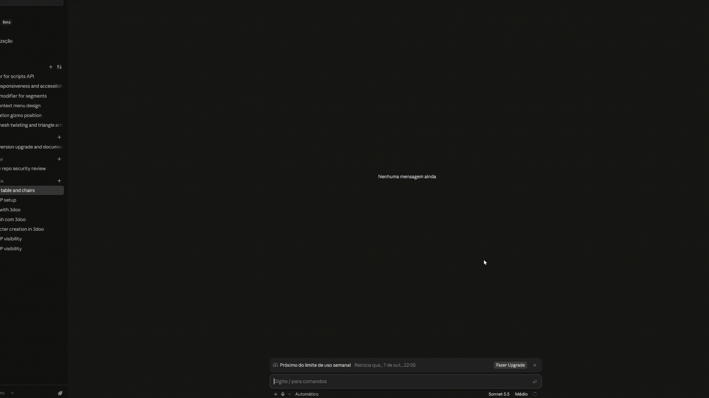

# 3DOO

3DOO is a 3D mesh editor that runs in the browser. You model with the
operations of a desktop package (extrude, inset, bevel, loop cut, knife,
dissolve and the rest) and export the result as OBJ or FBX, ready for a game
engine.

## Some things you can do with this software

### Proportional Editing for Organic modeling


### Simple 3D assets can be generated using AI (Just call it via the MCP Connection)



## Quick start

```bash
npm install
npm run dev      # http://localhost:5173
npm test
npm run build    # typecheck + production bundle
npm run lint
npm run mcp      # the MCP server for AI assistants, after a build (docs/mcp.md)
```

New to the code? Start with [docs/get-started.md](docs/get-started.md).

## What it does

- **Modelling**: ten parametric primitives, vertex, edge and face selection,
  and the full set of mesh operations, from extrude and bevel to bridge and
  tris-to-quads.
- **Modifiers**: mirror, array, solidify, bend, twist, weld, subdivision
  surface and remesh, all non-destructive and reorderable.
- **Objects**: transform gizmo, booleans, merge and separate, an outliner with
  groups, a 3D cursor and proportional editing.
- **Files**: `.3doo` projects, OBJ and FBX import, binary FBX 7.4 and OBJ
  export with engine axis presets, opt-in autosave to a folder you choose.
- **Touch**: runs on phones and tablets. Pinch to zoom, slide two fingers to
  pan, twist them to turn the view, and long-press for the right-click menus;
  the panels fold into drawers on narrow screens.
- **Scripting**: a code editor in the top bar that builds and edits the scene
  with JavaScript, in the spirit of Blender's Python console, with hover help
  linked to the docs. A run is one step to undo, and a failed run changes
  nothing.
- **AI assistants**: an MCP server lets Claude and other assistants build
  models with the scripting API and hand them back as files, pictures from any
  of the editor's views, or a link that opens the editor on the result. The
  MCP button in the top bar has the setup commands ready to copy; the details
  are in [docs/mcp.md](docs/mcp.md).

The full list, and how each tool behaves, is in
[docs/features.md](docs/features.md). Every shortcut is in
[docs/keymap.md](docs/keymap.md).

## How it is built

```text
              ┌──────────────────────┐
              │       React UI       │   panels, outliner, properties, dialogs
              └──────────┬───────────┘
                         ▼
              ┌──────────────────────┐
              │       Zustand        │   scene · tool · viewport · ui · preferences slices
              └───────┬───────┬──────┘
                      │       │
        ┌─────────────┘       └──────────────┐
        ▼                                    ▼
┌──────────────────┐                 ┌──────────────────┐
│   Mesh Kernel    │◄───  Bridge  ──►│     Three.js     │
│ BMesh · ops      │                 │ renderer, gizmo  │
│ modifiers · io   │                 │ picking, camera  │
└──────────────────┘                 └──────────────────┘
        │
        ▼
   OBJ · FBX
```

At the centre is a mesh kernel in plain TypeScript. It stores a half-edge
structure in the style of Blender's BMesh, so every vertex knows its edges and
every edge knows the faces on either side. Three rules keep the layers apart:

- **The kernel never imports React, Three.js or any browser API.** It runs and
  is tested in Node, and could be reused anywhere else.
- **Three.js is imperative and mounted once.** React does not reconcile
  scene-graph objects or vertices.
- **React owns the chrome only**: panels, forms, toolbars, dialogs, status.

**Stack**: Vite, React 18, TypeScript (strict), imperative Three.js, Zustand,
Sass. No Tailwind, no CSS-in-JS, no component library.

## Documentation

| Document | Covers |
| --- | --- |
| [get-started.md](docs/get-started.md) | What 3DOO is, the code layout and the core concepts, for new developers |
| [features.md](docs/features.md) | Everything the editor does, and how its tools behave and why |
| [keymap.md](docs/keymap.md) | Every key and mouse binding, and the camera key design |
| [architecture.md](docs/architecture.md) | How the layers and modules fit together and why |
| [mesh-kernel.md](docs/mesh-kernel.md) | The BMesh data structure, every modelling operation, and the modifier stack |
| [math.md](docs/math.md) | Coordinate system, winding, normals, mitering, triangulation |
| [state-management.md](docs/state-management.md) | Zustand slices, mesh versioning, undo |
| [rendering.md](docs/rendering.md) | The display bridge, buffers, picking, camera |
| [export.md](docs/export.md) | OBJ and binary FBX, axis presets, and the FBX pitfalls |
| [saving.md](docs/saving.md) | Project files, autosave, and what the browser keeps |
| [design-system.md](docs/design-system.md) | Brutalist tokens, mixins, and usability guardrails |
| [scripting.md](docs/scripting.md) | The operator registry, `exec`, and the scripting API behind the SCRIPT editor |
| [mcp.md](docs/mcp.md) | The MCP server for AI assistants: tools, payloads, the page API, snapshots and scene links |
| [mcp-package.md](docs/mcp-package.md) | Publishing the `3doo-mcp` npm package: building, bumping, releasing and keeping it in step with the app |
| [testing.md](docs/testing.md) | What is tested and how to add to it |

The user manual is not in this folder. It is the in-app Docs module, written in
[content.ts](src/modules/docs/content.ts).

## Licence

Unlicensed prototype.
